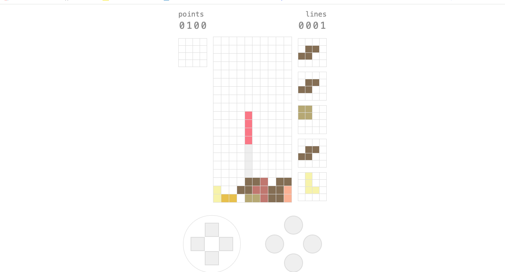
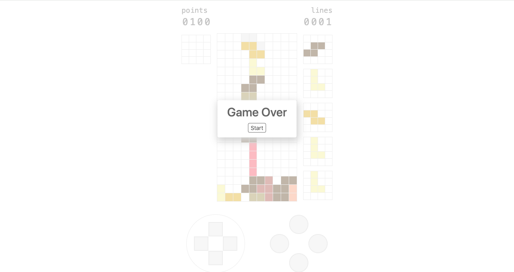

  

  <h3 align="center">Tetris</h3>

  

    <a href="https://react-tetris-five-kappa.vercel.app/">View Demo</a>
    ·
    <a href="https://github.com/Molly6943/React_Tetris/issues">Report Bug</a>
    ·
    <a href="https://github.com/Molly6943/React_Tetris/pulls">Request Feature</a>
  

<h4>Table of Contents</h4>

 

  
  
Home Page

  
  
Game Over Page

## Dev
1. `npm install`
2. `npm run dev`
